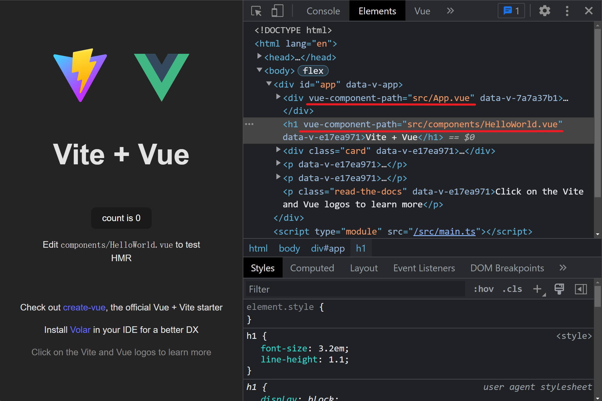

# vite-plugin-vue-component-path

A vite plugin that show where the vue component path is on browser devtools.



## Install

```bash
npm i -D vite-plugin-vue-component-path
# yarn add -D vite-plugin-vue-component-path
# pnpm i -D vite-plugin-vue-component-path
```
## Usage
```Javascript
// vite.config.js
import vue from "@vitejs/plugin-vue";
import vueComponentPath from "vite-plugin-vue-component-path";

export default defineConfig({
  plugins: [vue(), vueComponentPath()],
});
```

## Options
```Typescript
export interface Options {
  include?: FilterPattern
  exclude?: FilterPattern
  /**
   * @description The attribute name of the DOM to show the component path
   * @default 'vue-component-path'
   */
  attributeName?: string
}
```